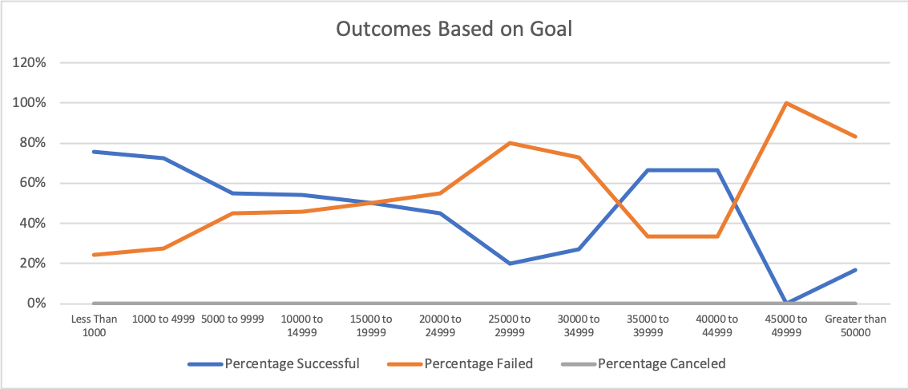

# Kickstarting with Excel

## Overview of Project
 Analyzing Kickstarter success for theater related campaigns.

### Purpose
Assess and visualize Kickstarter data to show correlation between a campaign outcomes and its launch date and fundraising goals.

## Analysis and Challenges

### Analysis of Outcomes Based on Launch Date
I looked at campaign outcomes based on launch date by creating a table that lists the number of campaigns in each outcome category based on the month of launch date. I then used that information to create a line graph to better show the months with the most successful campaigns.

### Analysis of Outcomes Based on Goals

I created a chart to show the percentage of successful, failed and canceled campaigns within several fundraising goal ranges. This chart helps to gain understanding goal amounts that are most attainable.

 The percentage of successful and failed campaigns based on fundraising goals is visualized below. 

### Challenges and Difficulties Encountered
A challenge I experiences was using the COUNTIFS() function in excel. Initially I kept getting zero as the result. Through filtering in the Kickstarter worksheet I was able to tell that my formula was wrong. After a few attempts I realized that I was giving the criteria of “play” instead of “plays.” The criteria have to be exact to pull correct data. Also, something that I found to be super helpful was actually knowing what I am filtering for by saying the criteria aloud while typing. 

## Results

- What are two conclusions you can draw about the Outcomes based on Launch Date?
   - (1) The most campaigns are launced in May
  (2)

- What can you conclude about the Outcomes based on Goals?

- What are some limitations of this dataset?
  (1) The data does not show if there are more successful campaigns in May because of the increase in the number of campiagins or if campaigns do better during that time of month. 

- What are some other possible tables and/or graphs that we could create?

